# Template Primărie Digitală - Diagrame Frontend

## 1. 🏗️ Arhitectura Frontend

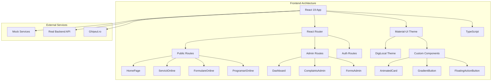

## 2. 📁 Structura Componentelor

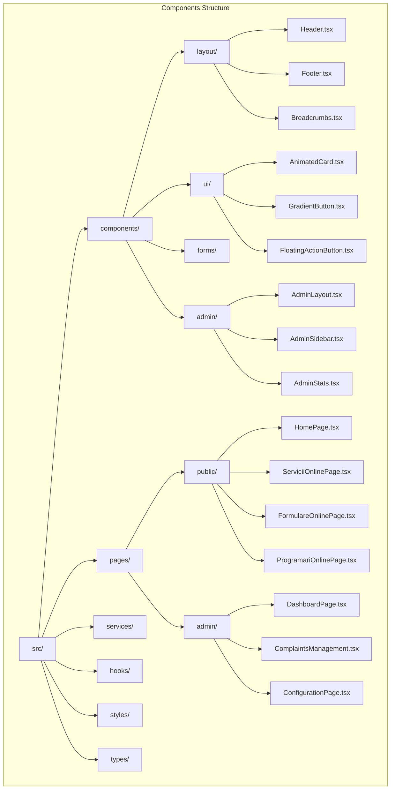

## 3. 🎨 Design System Flow

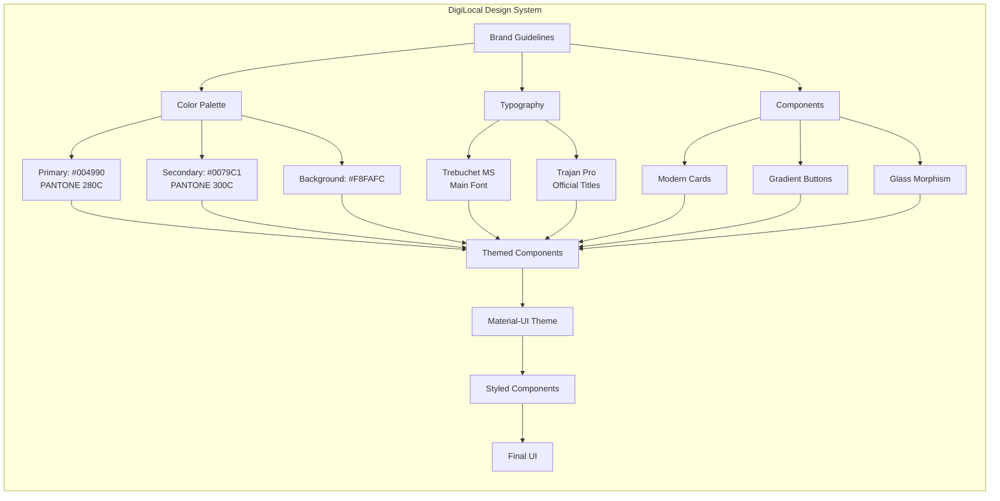

## 4. 🔄 State Management Flow

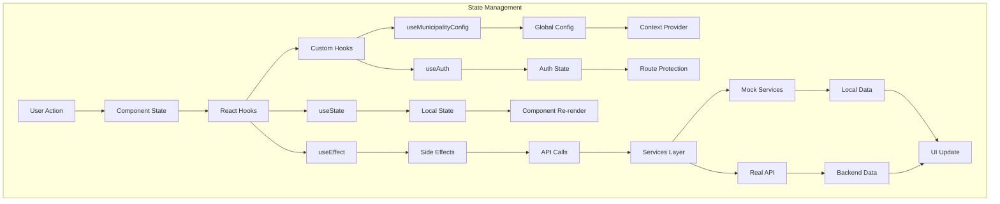

## 5. 🚦 User Journey - Sesizări

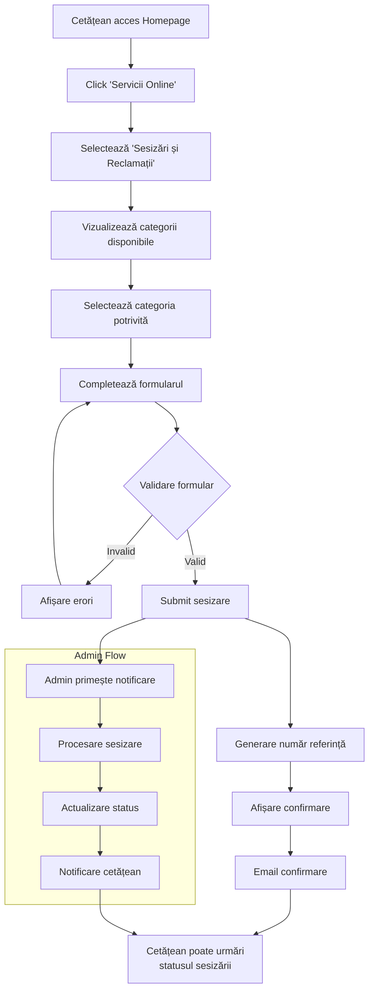

## 6. 📋 Form Handling Flow

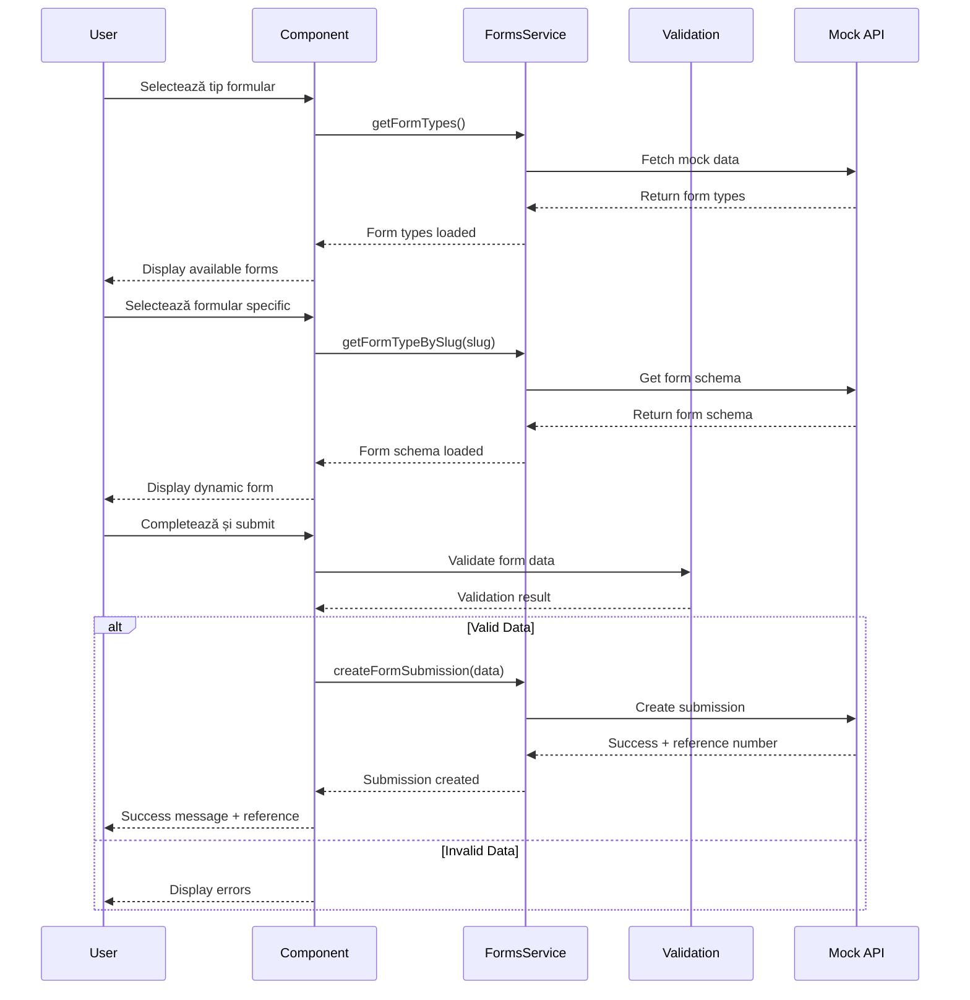

## 7. 🎯 Component Interaction

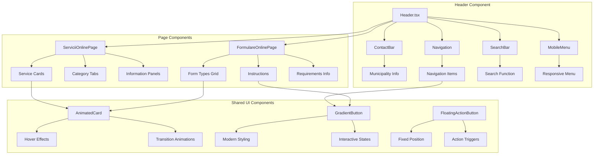

## 8. 📱 Responsive Breakpoints

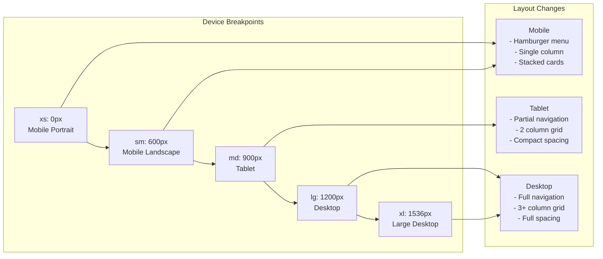

## 9. 🔐 Authentication Flow

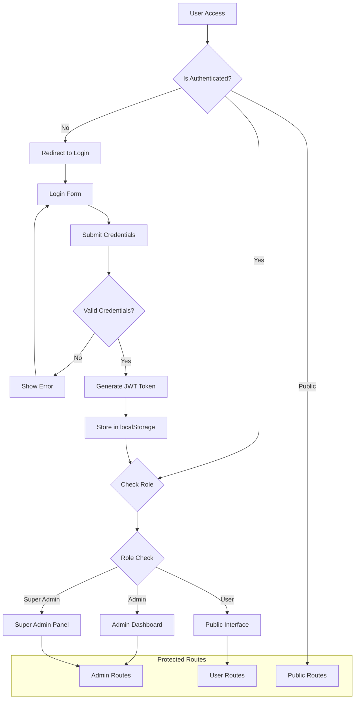

## 10. ⚡ Performance Optimization

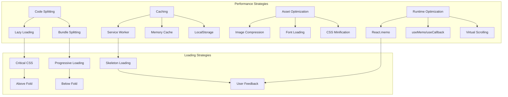

## 11. 🔄 Service Layer Architecture

```mermaid
graph TD
    subgraph "Services Architecture"
        A[API Service Base] --> B[HTTP Client (Axios)]
        A --> C[Error Handling]
        A --> D[Request Interceptors]
        A --> E[Response Interceptors]
        
        F[FormsService] --> A
        G[ComplaintsService] --> A
        H[AppointmentsService] --> A
        I[AuthService] --> A
        
        F --> J[Mock Forms Data]
        G --> K[Mock Complaints Data]
        H --> L[Mock Appointments Data]
        
        J --> M[getFormTypes()]
        J --> N[createSubmission()]
        K --> O[getCategories()]
        K --> P[createComplaint()]
        L --> Q[getServices()]
        L --> R[bookAppointment()]
        
        subgraph "Development Mode"
            S[Mock Responses]
            T[Simulated Delays]
            U[Error Simulation]
        end
        
        M --> S
        N --> T
        O --> S
        P --> T
        Q --> U
        R --> S
    end
```

## 12. 🎨 Theme System Architecture

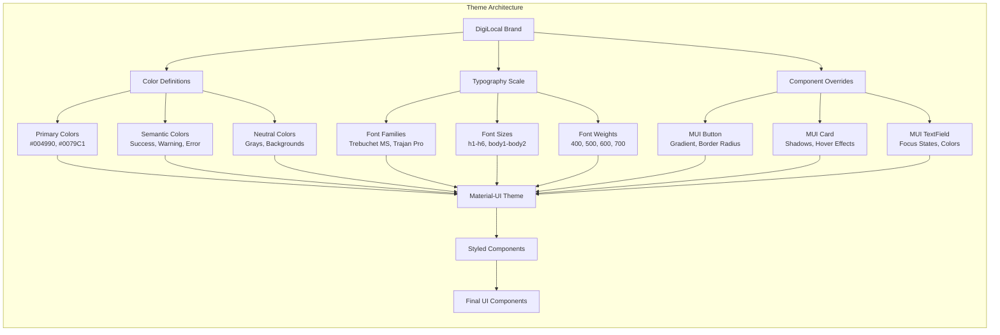

---

## 📊 Legenda Simboluri

- 🏗️ **Arhitectură** - Structura generală
- 📁 **Componente** - Organizarea fișierelor
- 🎨 **Design** - Sistem de design
- 🔄 **State** - Management de stare
- 🚦 **Flow** - Fluxuri utilizator
- 📋 **Forms** - Gestionarea formularelor
- 🎯 **Interacțiuni** - Comunicarea între componente
- 📱 **Responsive** - Design adaptiv
- 🔐 **Auth** - Autentificare
- ⚡ **Performance** - Optimizări
- 🔄 **Services** - Servicii backend
- 🎨 **Theme** - Sistem de tematizare

**Toate diagramele sunt în format Mermaid și pot fi vizualizate în GitHub, GitLab, sau orice editor care suportă Mermaid.**